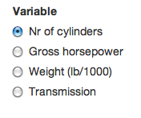
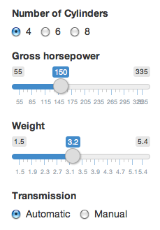

Introduction
---------------------

The application available in the **Prediction** tab was created as a project for coursera Developing Data Products course. The application operates in *mtcars* R dataset. As a part of the task linear model has been developed. To estimate

* mpg - Miles/(US) gallon

the model uses four predictions: 

* cyl - Number of cylinders
* hp - Gross horsepower
* wt - Weight (lb/1000)
* am - Transmission (0 = automatic, 1 = manual)

Using the dashbord the user is able to: 

* display the histograms of the predictors
* plot relation between single predictiors and *mpg*
* estimate the *mpg* value for given car parameters

Instructions
--------------------

In the first radiobutton box called **Variables** the user can set one of the four predictors.

When a predictor is selected the histogram in the section **Distribution of the variable** is updated to show the selected variable. Moreover, the plot in the section **Miles per Gallon versus Selected Varibale** is also updated to show the relation between *mpg* and the selected predictor. In case of categorical variables boxplot is displayed and for numerical variables scatterplot with linear regression line.

In the next radiobuttons and sliders the user may set the parameters of a car of interest.

In the textbox in the section **Prediciton** the user will get the information what *mpg* value has been predicted for the given parameters of the car. Also the values for lower and upper bounds of the 95% confidence interval are displayed.
